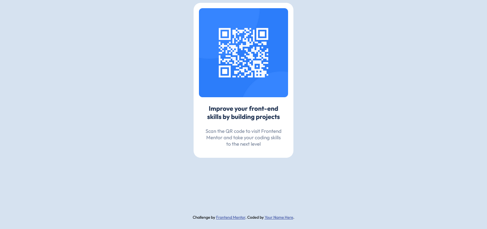

# Frontend Mentor - QR code component solution

This is a solution to the [QR code component challenge on Frontend Mentor](https://www.frontendmentor.io/challenges/qr-code-component-iux_sIO_H). Frontend Mentor challenges help you improve your coding skills by building realistic projects. 

## Table of contents

- [Overview](#overview)
  - [Screenshot](#screenshot)
- [My process](#my-process)
  - [Built with](#built-with)
  - [Continued development](#continued-development)
- [Author](#author)

## Overview

### Screenshot

## My process

### Built with

- Semantic HTML5 markup
- CSS custom properties
- Flexbox
- CSS Grid

### Continued development

I want to continue working on how I place things on the page. This project is using flexbox but I would also learn CSS grids.

## Author

- Github - [Anurag Lodhi](https://github.com/AnuragLodhi)
- Frontend Mentor - [@AnuragLodhi](https://www.frontendmentor.io/profile/AnuragLodhi)
